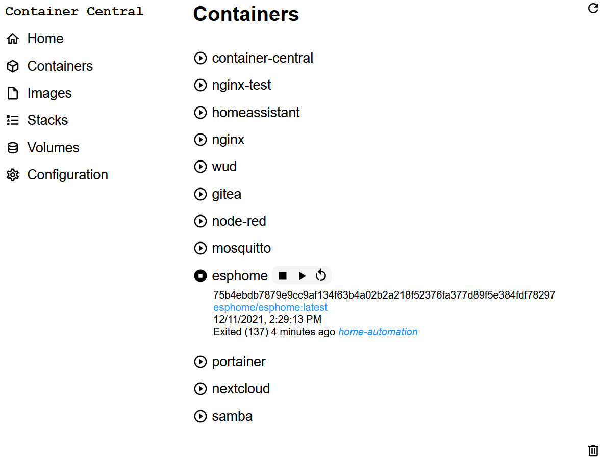
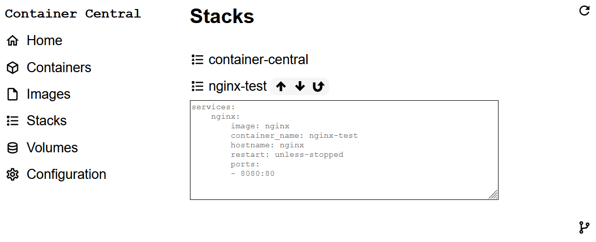

# Running
The easiest way to run Container Central is to use a container and a docker run command like this:

```
docker run -d \
  --name container-central \
  -p 8088:8088 \
  -v /var/run/docker.sock:/var/run/docker.sock \
  davescodemusings/container-central:latest
```

# Using
Point your browser to your Pi, like this: http://mypi.home:8088 (or use the IP address.) You'll see a simple menu like this:


Things will look slightly different on mobile phones and other small screen devices, but the basic menu items are the same.

* Containers
* Images
* Stacks
* Volumes

## Containers
Click or tap on containers. You will see a list of Docker containers running on the host.



The state of each container is shown by the round icon before the container's name. A triangle indicates it's running. A square indicates it is stopped. In the screenshot above, all containers are running except for esphome.

Clicking or tapping on the container name will open up details about the containers. You're also presented with controls to stop, start, or restart the container, depending on its present state. The mosquitto container shows an example of this.

(On desktop systems, you can hover your mouse over a container name to reveal these controls.)

Starting or stopping can take a moment, so be patient. You'll get a pop-up box with the status once the operation is complete.

You can only control existing containers. You cannot run a new container from the containers view. See Stacks for how to run new containers.

## Images
Select images and you will see all of the container images, similar to using the command `docker image ls`.


You can get a quick estimation of a container's age by looking at the calendar icon in front of its name. If the calendar has a check mark in it, the image is less than 30 days old. If the calendar has a clock in it, the image is older than 30 days.

If you expand the details of the container you'll be presented with more information and a download option to pull a more recent version. (The download option also appears if you hover the mouse pointer.)

Image downloads can take a bit of time. A pop-up will appear when it's done.

## Stacks
Select the stacks menu choice and you will see a list of Docker Compose projects.



What you see here are any Docker Compose YAML files that happen to be saved in the container-central/compose directory. By default, Container Central includes a simple Nginx project in the file nginx.yml. The screenshot above shows several projects, with Nginx open to show details and the controls.

Clicking the up arrow will deploy the stack, just like typing the command `docker-compose -f nginx.yml -p nginx up -d` The down arrow is the same as `docker-compose down` and the U-turn arrow will let you do a restart.

You can create your own Docker Compose YAML and save it in the container-central/compose directory. Name the file with the stack name. For example, file-sharing.yml in container-central/compose that appears here as _file-sharing_.

## Volumes
Select volumes to view Docker Volume information as if you had typed `docker volume ls` from the command-line. It's not very exciting, so there's no screenshot.

# Making Container Central Work for You
Container Central designed to work with Docker command-line tools, not replace them. You will occasionally need to visit the shell prompt for some tasks. But here's what you can do:

1. Create a Docker Compose YAML file for your project and save it in container-central/compose.
2. Open up Container Central and click the Stacks menu.
3. Find the Docker Compose project in the list and deploy the stack.

You can still manage the stack and individual components from command-line if you want to, but you don't have to. Here's another example.

1. You select Container Central's Images view and see that one of your containers is getting old.
2. Use the download control to pull a new image.
3. Visit the Stacks menu and use the up arrow to re-deploy the stack.

Behind the scenes, docker-compose takes care of determining which containers have new images available and will redeploy them as needed.
