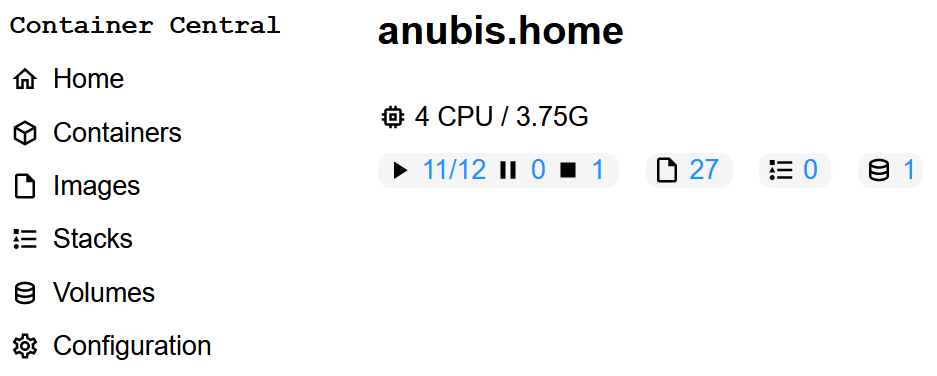
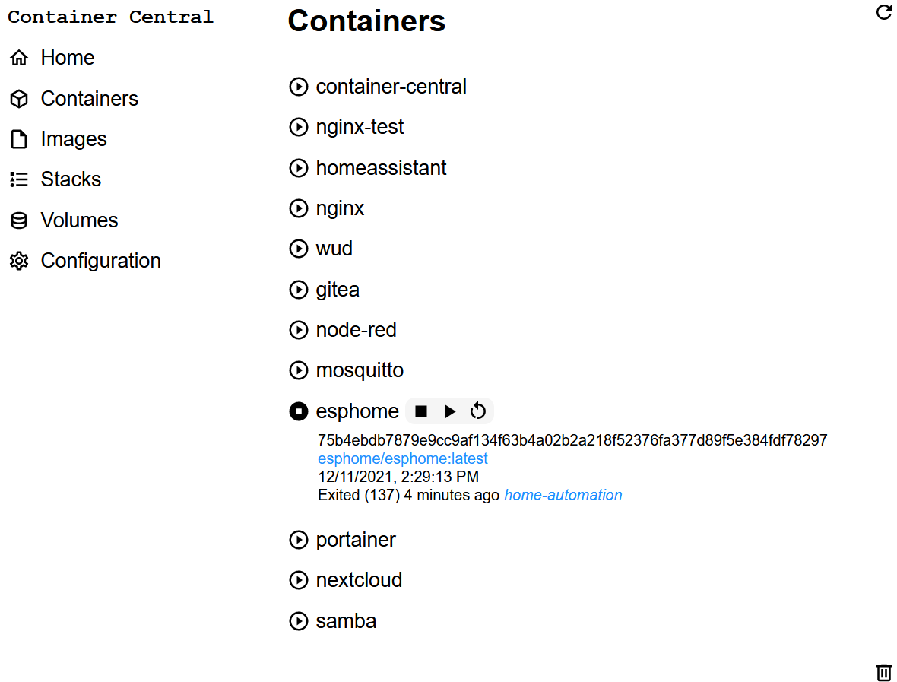
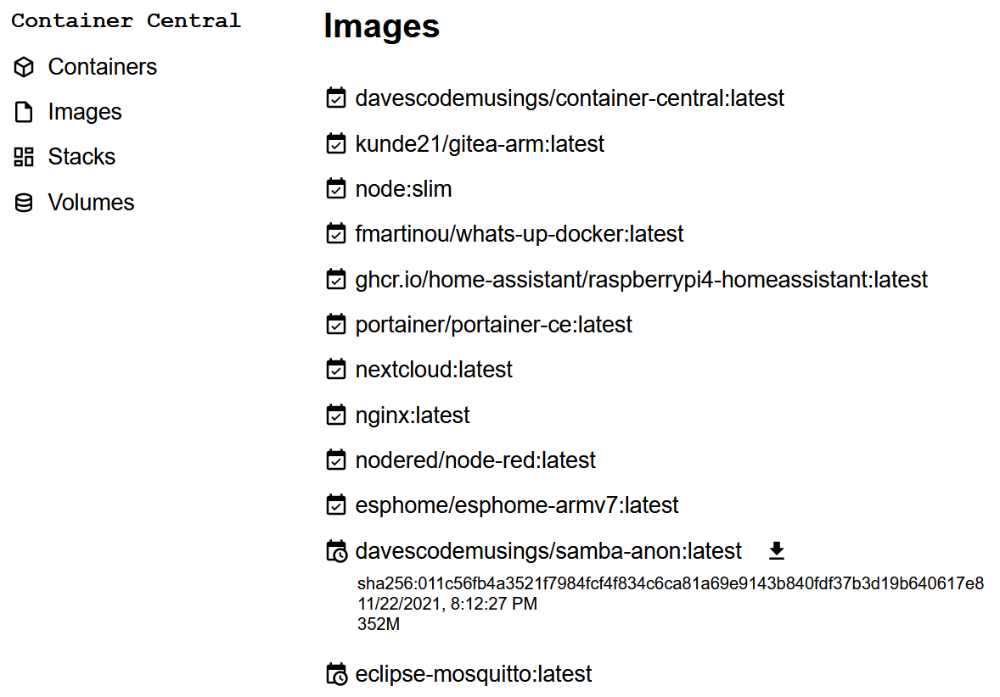
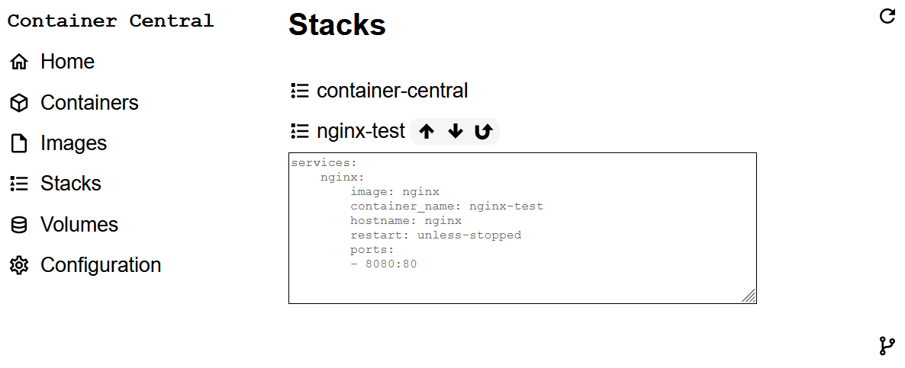

# Container Central Quick Start

## Running
On Raspberry Pi, the easiest way to run Container Central is to use the Docker container.

First, create a _data_ directory to store Container Central's persistent settings.

Then, start the container with a bind mount for _data_.

```
mkdir data
docker run -d \
  --name container-central \
  -p 8088:8088 \
  -v /var/run/docker.sock:/var/run/docker.sock \
  -v ${PWD}/data:/app/data \
  davescodemusings/container-central:latest
```

## Exploring
Point your browser to your Pi, like this: http://mypi.home:8088 (or use the IP address.) You'll see a simple menu and an overview of your system, like this:



The layout will be slightly different on mobile phones and other small screen devices, but the information displayed is the same.

Underneath the information about your system resources, you'll see a status of the containers. Refering to the screenshot, you can see eleven of twelve containers are running, none are paused, and one is stopped.

You can also see that there are seventeen Docker images, two Docker Compose stacks, and one Docker volume. Clicking or tapping on any of these items will take you to a more detailed view. (You can also use the menu selections on the left to do the same thing.)

### Containers
Click or tap on containers. You will see a list of Docker containers running on the host.



The state of each container is shown by the round icon before the container's name. A triangle indicates it's running. A square indicates it is stopped. In the screenshot above, all containers are running except for esphome.

Clicking or tapping on the container name will open up details about the containers. You're also presented with controls to stop, start, or restart the container.

If there are stopped containers, you'll see a trash can icon at the bottom of the list. You can tap or click this to remove (prune in Docker lingo) the stopped containers.

### Images
Select images and you will see all the container images, similar to using the command `docker image ls`.



You can get a quick estimation of a container's age by looking at the calendar icon in front of its name. If the calendar has a check mark in it, the image is less than 30 days old. If the calendar has a clock in it, the image is older than 30 days.

If you expand the details of the container you'll be presented with more information and a download option to pull a more recent version. (The download option also appears if you hover the mouse pointer.) Image downloads can take a bit of time. A pop-up will appear when it's done.

If any images are no longer being used, a trash can icon will appear at the bottom of the list. Click or tap to delete the unused images.

### Stacks
Select the stacks menu choice and you will see a list of Docker Compose projects.



What you see here are any Docker Compose YAML files that happen to be saved in the container-central/compose directory. By default, Container Central includes a simple Nginx project in the file nginx.yml. The screenshot above shows several projects, with Nginx open to show details and the controls.

Clicking the up arrow will deploy the stack, just like typing the command `docker-compose -f nginx.yml -p nginx up -d` The down arrow is the same as `docker-compose down` and the U-turn arrow will let you do a restart.

You can create your own Docker Compose YAML and save it in the container-central/compose directory. Name the file with the stack name. For example, file-sharing.yml in container-central/compose that appears here as _file-sharing_.

_There is a git integration planned as an enhancement._

### Volumes
Select volumes to view Docker Volume information as if you had typed `docker volume ls` from the command-line. It's not very exciting, so there's no screenshot.

### Configuration
This is where you can enter site specific settings, like the URL for the git repository you use to store your Docker Compose files.

## Next Steps
For a more in-depth look at how to use Container Central, see the [HowTo docuument](HowTo.md)
